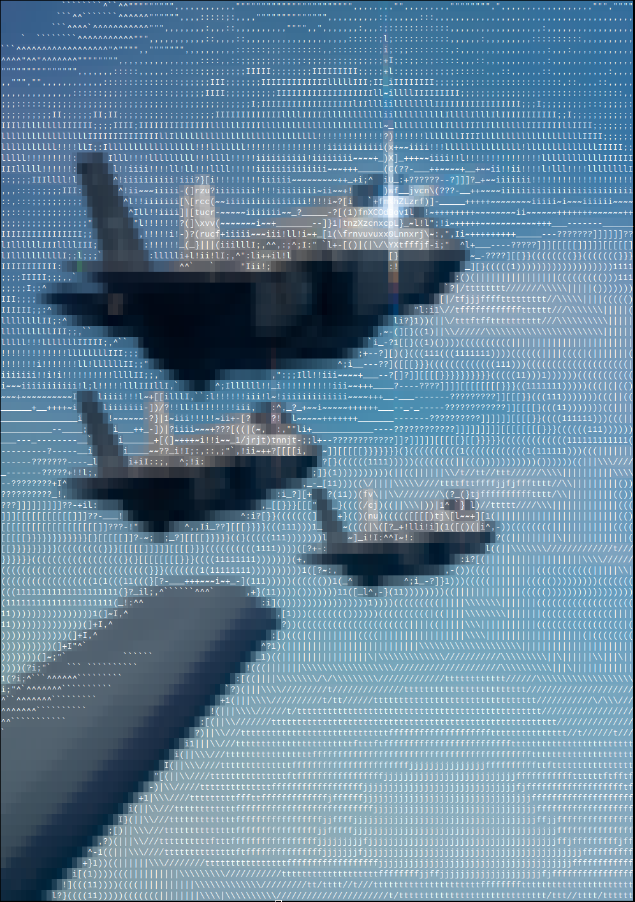
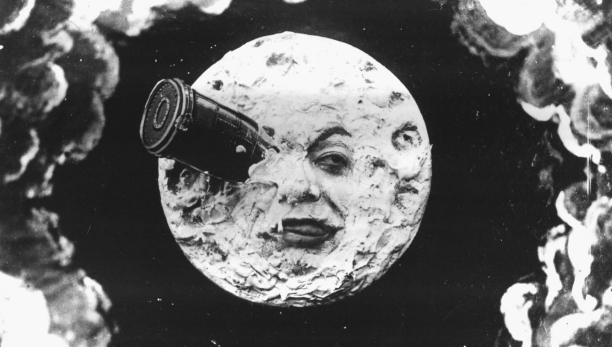

simple image to (coloured) ascii converter, in c, with stb

only works on truecolor terminals, on linux systems

    Usage: ascii-to-image <path to image>
    Options:
         -s: Scale image to terminal size
         -h: Print this message: 

### Examples
the aspect ratio looks a bit off because terminal characters are taller than they are wide 

