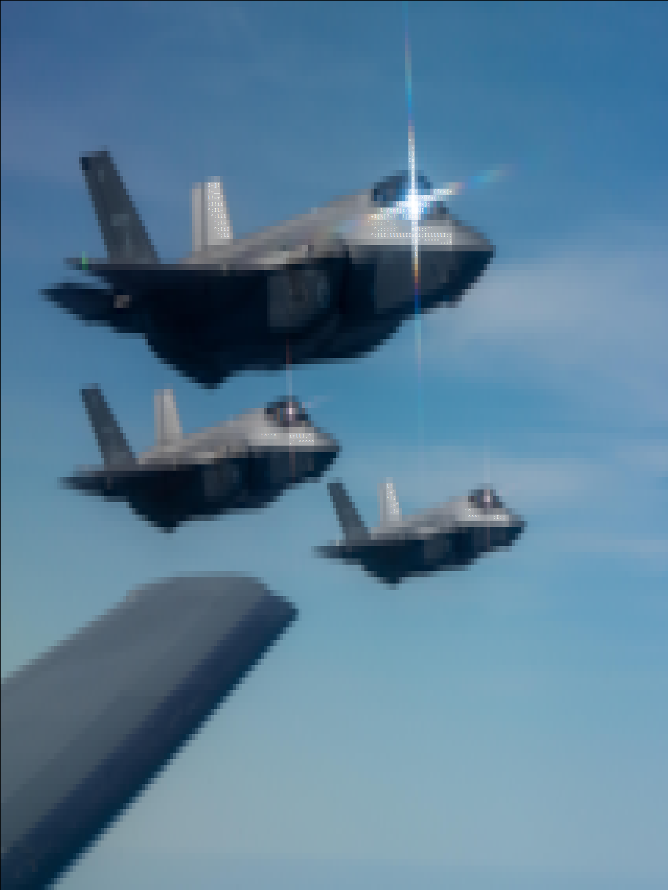
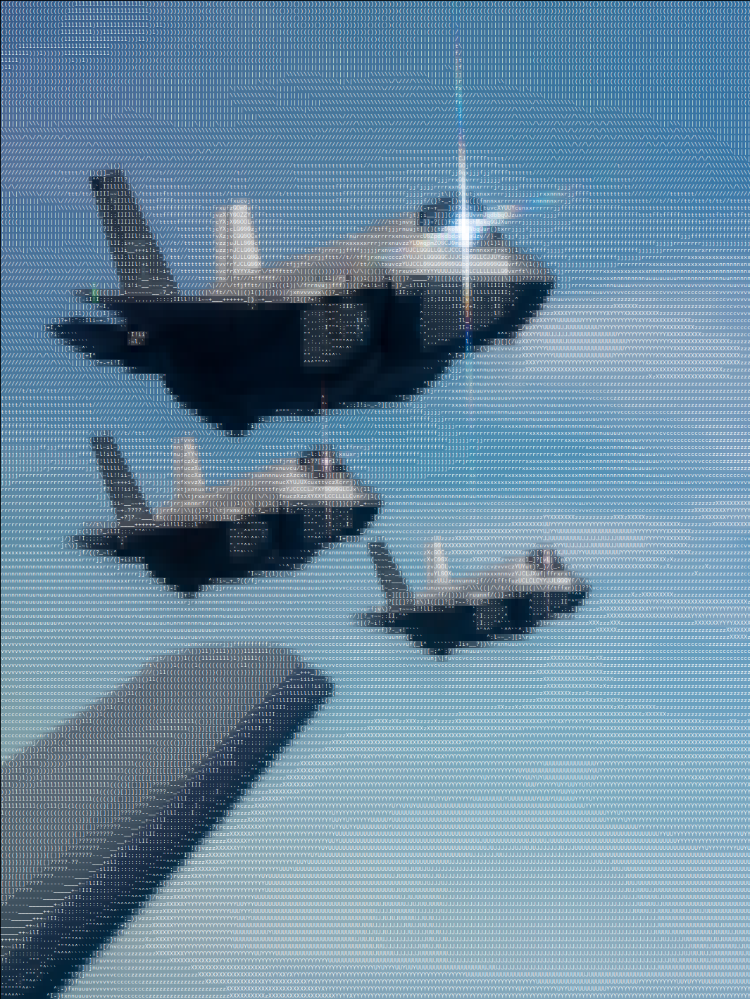
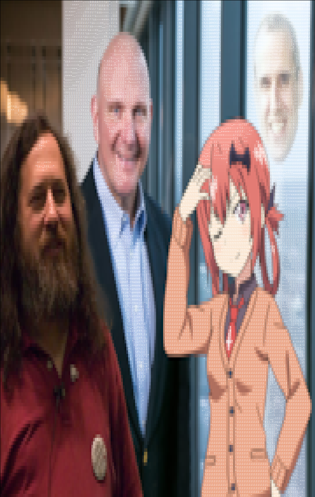
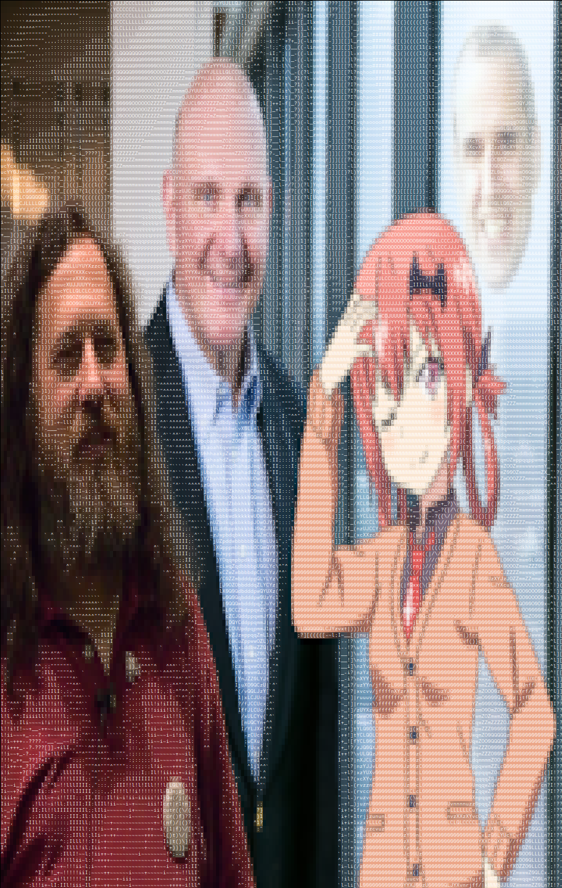

simple program using stb that converts an image to a terminal image using ansi codes & ascii text

only works on truecolor terminals, on linux systems, and DOES NOT work with webms

Usage: ascii-to-image -<options> <path to image>
Options:
	-s: Scale image to terminal size
	-h: Print this message:
	<0-9>: Level of characters in image, 0 = most characters, 9 = only background colours 
Example:
	image-to-ascii -9s ./image.jpeg

### Examples
the aspect ratio looks a bit off because terminal characters are taller than they are wide, 2nd image sourced from [/g/](https://4chan.org/g/)
from original image

        |
        V
image at low ascii character count
        |
        V
image at high ascii character count

